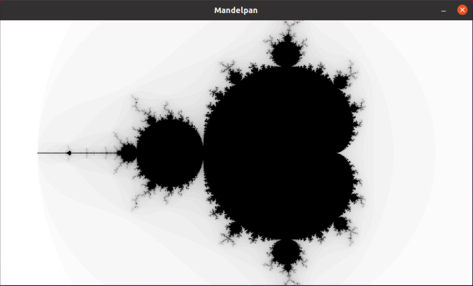

# Mandelpan

Mandelpan is a tool that allows you to explore the Mandelbrot set. You can zoom in and out, and move around the complex plane by using the arrow keys and Q and E.



The project structure looks as follows:

- `main.cpp`: handles the initialization and deinitialization of the *SDL2* library and creates the main window of the application.
- `window.{cpp,h}`: defines the class *Window* which is a wrapper around an SDL_Window handle. The constructor creates the *SDL_Window* alongside a renderer and a texture to draw the fractals into. Those resources are freed in the destructor following the RAII principle. Additionally, user events and screen refresh delays are handled by methods of this class.
- `camera.{cpp,h}`: defines the class *Camera* which contains the horizontal and vertical positions and zoom level as private members. Additionally it provides public accessors and mutators with the corresponding checks.
- `renderer.{cpp,h}`: defines a *Renderer* class which draws the Mandelbrot set in a pixel buffer given its width and height dimensions and the parameters of the camera described above. It also defines the output pixel format (RGBA8888) through a *Pixel* structure.

Rubric points:

1.  > **Loops, Functions, I/O**
    >
    > The project demonstrates an understanding of C++ functions and control structures.
    
    Where: Usage of complex control flow structures with `for` and `if` in *Renderer::render* ([renderer.cpp:44-58](https://github.com/7F23/Mandelpan/blob/69cfee5/src/renderer.cpp#L44-L58)).

2.  > **Object Oriented Programming**
    >
    > The project uses Object Oriented Programming techniques.

    Where: Both Window ([window.h:7](https://github.com/7F23/Mandelpan/blob/69cfee5/src/window.h#L7)) and Camera ([camera.h:3](https://github.com/7F23/Mandelpan/blob/69cfee5/src/camera.h#L3)) classes hold data members, which are allocated+initialized and deallocated during construction and destruction, respectively. Additionally, there exist methods to perform tasks, such as *Window::task* ([window.cpp:82-105](https://github.com/7F23/Mandelpan/blob/69cfee5/src/window.cpp#L82-L105))

3.  > **Object Oriented Programming**
    >
    > Classes use appropriate access specifiers for class members.

    Where: The classes in this project provide explicit access specifiers to data members and methods. The most notable example is the *Camera* class definition in [camera.h:3-25](https://github.com/7F23/Mandelpan/blob/69cfee5/src/camera.h#L3-L25), which declares private members, which are readable through public const accessors and modifiable thorough public mutators that check for invariants (e.g. camera zoom should be non-negative).

4.  > **Object Oriented Programming**
    >
    > Class constructors utilize member initialization lists.

    Where: Used in the *Camera* constructor definition in [camera.h:5-10](https://github.com/7F23/Mandelpan/blob/69cfee5/src/camera.h#L5-L10). It receives arguments (which are optional thanks to the use of default arguments) for the horizontal position, vertical position and zoom level. Then, initialization lists will initialize the Camera members using those values.

5.  > **Memory Management**
    >
    > The project uses scope / Resource Acquisition Is Initialization (RAII) where appropriate.

    Where: All Window resources are acquired during the constructor *Window::Window* ([window.cpp:12-22](https://github.com/7F23/Mandelpan/blob/69cfee5/src/window.cpp#L12-L22)) and released during the destructor *Window::~Window* ([window.cpp:27-29](https://github.com/7F23/Mandelpan/blob/69cfee5/src/window.cpp#L27-L29)). This causes, for instance, all *Window* instance resources to be automatically freed at the end of the scope of `openMandelbrotWindow` in [main.cpp:14](https://github.com/7F23/Mandelpan/blob/69cfee5/src/main.cpp#L14).


## Dependencies

Build system dependencies:

* cmake >= 3.7
  * All OSes: [click here for installation instructions](https://cmake.org/install/)
* make >= 4.1 (Linux, Mac), 3.81 (Windows)
  * Linux: make is installed by default on most Linux distros
  * Mac: [install Xcode command line tools to get make](https://developer.apple.com/xcode/features/)
  * Windows: [Click here for installation instructions](http://gnuwin32.sourceforge.net/packages/make.htm)
* gcc/g++ >= 5.4
  * Linux: gcc / g++ is installed by default on most Linux distros
  * Mac: same deal as make - [install Xcode command line tools](https://developer.apple.com/xcode/features/)
  * Windows: Visual Studio or [MinGW](http://www.mingw.org/).

Library dependencies: Follow instructions below


## Building

### Linux

1. Install SDL2 from your package manager:
    - Ubuntu: `sudo apt-get update && sudo apt-get install libsdl2-dev`.
2. Build the project:
    ```
    mkdir build && cd build
    cmake ..
    cmake --build . --parallel $(nproc)
    ```
3. Run the project:
    ```
    ./Mandelpan
    ```
    
### Windows

1. Install SDL2 development libraries for Visual C++ from: https://www.libsdl.org/download-2.0.php 
2. Update the `SDL2_PATH` in *CMakeSettings.json* to the installation path of SDL2.
2. Open the root folder with Visual Studio and build the *Mandelpan* target.
3. Run the target:
    ```
    ./Mandelpan.exe
    ```
